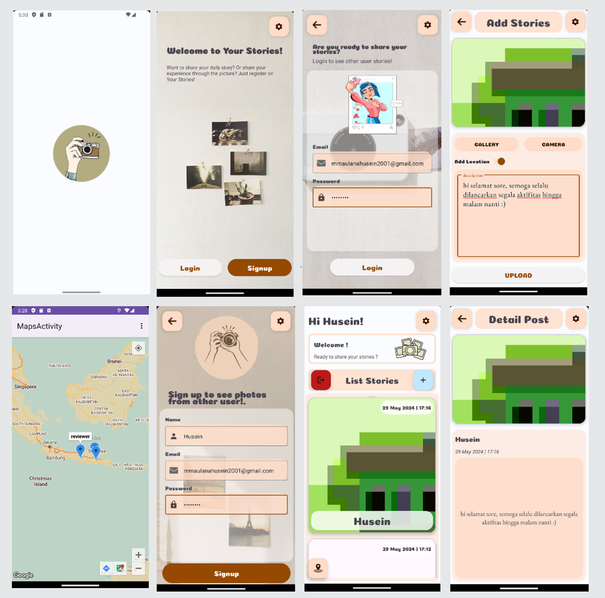

<h1 align="center">
  MyAppStory
</h1>

  This repository holds the source code for my project submissions during the <a href="https://www.dicoding.com/academies/352" target="_blank">Belajar Pengembangan Aplikasi Android Intermediate</a> course at Dicoding. It encompasses all submissions from the initial to the final stage. This course is part of my self-paced learning journey within the Bangkit 2023 Mobile Development track. Throughout this project, I strive to apply the best practices of Kotlin programming and the Android framework.

## 📱 Screenshot App

  

## ⚠️ Disclaimer
> "This repository is intended only for educational and sharing purposes. Plagiarism is unacceptable and any instances of it are not the responsibility of the author."
